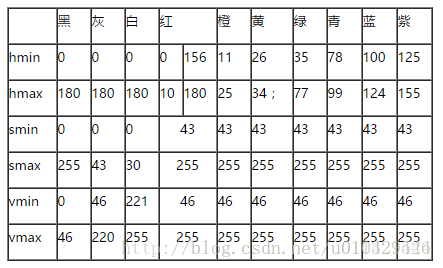

## OpenCV学习笔记

### 一、环境搭建

**windows + python3.7**

> pip install opencv-python  
> pip install -i https://pypi.douban.com/simple opencv-contrib-python    
>pip install pytesseract

### 二、课程内容

### 1.第一节课

知识点小结：

* 读取图片：src = cv.imread("pic/path/xxx.jpg")
* 创建GUI显示图片：cv.namedWindow("xxx", cv.WINDOW_AUTOSIZE)
* 设置等待，否则会已知等待到下一个用户操作：cv.waitKey(0)

**完整代码如下**：

```python
import cv2 as cv

src = cv.imread("../pictures/reba.jpg")

#创建GUI显示图片
cv.namedWindow("input image", cv.WINDOW_AUTOSIZE)
cv.imshow("input iamge", src)

#如果不设置等待多久，会等待下一个用户操作才会关掉
cv.waitKey(0)
cv.destroyAllWindows()
```

### 2.第二节课

 知识点小结：

* 打开本机摄像头：cv.VideoCapture(0)
* 翻转摄像头：cv.flip(frame, 1)
* 转成灰度图像：gray = cv.cvtColor(src, cv.COLOR_BGR_AUTOSIZE)

**完整代码如下:**

```python
import cv2 as cv
import numpy as np

def get_image_info(image):
    print(type(image))
    print(image.shape)
    print(image.size)
    print(image.dtype)
    pixel_data = np.array(image)
    print(pixel_data)


def video_demo():

    #打开电脑相机
    capture = cv.VideoCapture(0)
    while True:
        ret, frame = capture.read()
        #反转摄像头
        frame = cv.flip(frame, 1)
        cv.imshow("video", frame)
        c = cv.waitKey(50)
        if c == 27:
            break

src = cv.imread("../pictures/reba.jpg")

#创建GUI显示图片
# cv.namedWindow("input image", cv.WINDOW_AUTOSIZE)
cv.imshow("input iamge", src)
get_image_info(src)
#转成灰度图像
gray = cv.cvtColor(src, cv.COLOR_BGR2GRAY)
cv.imwrite('reba2.jpg', gray)

#如果不设置等待多久，会等待下一个用户操作才会关掉
cv.waitKey(0)
cv.destroyAllWindows()
```

### 3.第三节课

知识点小结：

* 利用for循环遍历每一个像素点

    ```python
    for row in range(height):
        for col in range(width):
            for c in range(channels):
                pv = image[row, col, c]
    ```
* 像素取反 255- pv
    ```python
    pv = image[row, col, c
    image[row, col, c] = 255 - pv
    ```

* 生成三通道下指定通道颜色的图像
    ```python
    # 3个通道的顺序：blue、green、red
    img = np.zeros([400, 400, 3], np.uint8)
    img[:, :, 0] = np.ones([400, 400])*255 #生成第1个通道，即blue颜色图像
    cv.imshow("new image", img)
    ```
* 生成单通道颜色图像
    ```python
    # 生成单通道图像
    img = np.ones([400, 400, 1], np.uint8)
    img = img * 127 # 灰度图像
    cv.imshow("new image", img)
    ```

* 利用API函数bitwise_not(image)实现像素取反功能(更高效)
    ```python
    def inverse(image):
        dst = cv.bitwise_not(image)
        cv.imshow("inverse demo", dst)
    ```

**完整代码如下**：

```python
import cv2 as cv
import numpy as np


def access_pixels(image):
    print(image.shape)
    height = image.shape[0]
    width = image.shape[1]
    channels = image.shape[2]
    print("width: %s, hieght: %s, channel: %s" %(width, height, channels))

    for row in range(height):
        for col in range(width):
            for c in range(channels):
                pv = image[row, col, c]
                image[row, col, c] = 255 - pv
    cv.imshow("pixels_demo", image)


def create_image():
    # 3个通道的顺序：blue、green、red
    # img = np.zeros([400, 400, 3], np.uint8)
    # img[:, :, 0] = np.ones([400, 400])*255
    # cv.imshow("new image", img)

    # 生成单通道图像
    img = np.ones([400, 400, 1], np.uint8)
    img = img * 127
    cv.imshow("new image", img)


src = cv.imread("../pictures/reba.jpg")


# 创建GUI显示图片
# cv.namedWindow("input image", cv.WINDOW_AUTOSIZE)
cv.imshow("input iamge", src)

# 计时
t1 = cv.getTickCount()
# access_pixels(src)
create_image()
t2 = cv.getTickCount()
time = (t2 - t1) / cv.getTickFrequency()
print("Time: %s ms" % time)


# 如果不设置等待多久，会等待下一个用户操作才会关掉
cv.waitKey(0)
cv.destroyAllWindows()
```

### 4.第四节课

#### 色彩空间

知识点小结：

* 常见的色彩空间:
  * RGB
  * HSV
  * HIS
  * Ycrcb
  * YUV

* opencv提供了转换的接口函数
    ```python
    gray = cv.cvtColor(image, cv.COLOR_BGR2GRAY)
    hsv = cv.cvtColor(image, cv.COLOR_BGR2HSV)
    yuv = cv.cvtColor(image, cv.COLOR_BGR2YUV)
    Ycrcb = cv.cvtColor(image, cv.COLOR_BGR2YCR_CB)
    ````

* HSV色彩空间范围：
    * H: 0-180
    * S: 0-255
    * V: 0-255

* 色彩空间转换:利用inRange()函数，过滤视频中颜色，实现跟踪某一颜色。
    > 例如跟踪绿色：

    ```python
    hsv = cv.cvtColor(frame, cv.COLOR_BGR2HSV)
    # 跟踪绿色
    lower_hsv = np.array([35, 43, 46])
    upper_hsv = np.array([77, 255, 255])
    mask = cv.inRange(hsv, lower=lower_hsv, upper=upper_hsv)
    cv.show('vide', frame)
    ```
* HSV颜色对应RGB的分量范围:  

    

* 通道分离与合并：
    * split()函数可实现分离

        ```python
        b, g, r = cv.split(src)
        cv.show('blue', b)
        cv.show('green', g)
        cv.show('red', r)
        ```

    * merge()函数可实现合并
        ```python
        src = cv.merge([b, g, r])
        cv.show("merged image", src)
        ```

**完整代码如下：**
```python
import cv2 as cv
import numpy as np
# import pandas as pd


def color_apace_demo(image):
	gray = cv.cvtColor(image, cv.COLOR_BGR2GRAY)
	cv.imshow('gray', gray)
	hsv = cv.cvtColor(image, cv.COLOR_BGR2HSV)
	cv.imshow('hsv', hsv)
	yuv = cv.cvtColor(image, cv.COLOR_BGR2YUV)
	cv.imshow('yuv', yuv)
	Ycrcb = cv.cvtColor(image, cv.COLOR_BGR2YCR_CB)
	cv.imshow("Ycrcb", Ycrcb)


def extract_object_demo():
	capture = cv.VideoCapture("red.mp4")
	while True:
		ret, frame = capture.read()
		if ret == False:
			break
		hsv = cv.cvtColor(frame, cv.COLOR_BGR2HSV)
		lower_hsv = np.array([156, 43, 46])
		upper_hsv = np.array([180, 255, 255])
		mask = cv.inRange(hsv, lowerb=lower_hsv, upperb=upper_hsv)
		cv.imshow("video", frame)
		cv.imshow("mask", mask)
		c = cv.waitKey(40)
		if c == 27:
			break


src = cv.imread("../pictures/reba.jpg")

# 创建GUI显示图片
# cv.namedWindow("input image", cv.WINDOW_AUTOSIZE)
cv.imshow("input iamge", src)
# color_apace_demo(src)
# extract_object_demo()
b, g, r = cv.split(src)
cv.imshow('blue', b)
cv.imshow('green', g)
cv.imshow('red', r)

src[:, :, 2] = 0
cv.imshow("changed image", src)

src = cv.merge([b, g, r])
cv.imshow("mergerd image", src)

# 如果不设置等待多久，会等待下一个用户操作才会关掉
cv.waitKey(0)
cv.destroyAllWindows()
```
